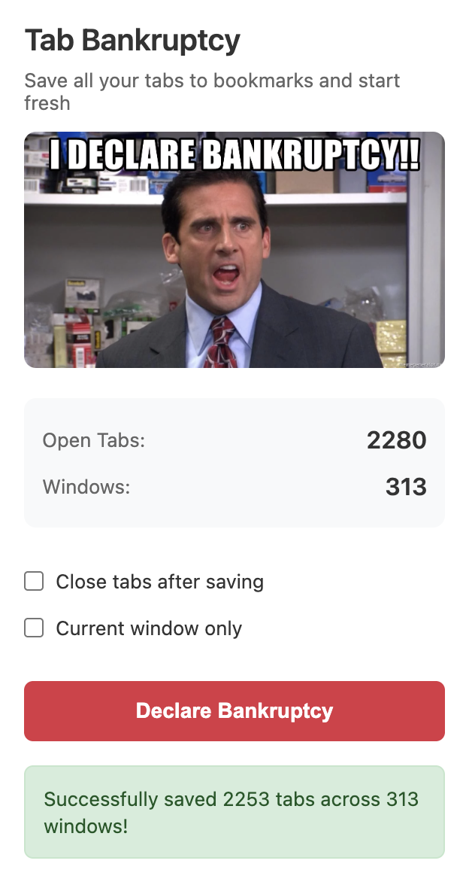

# Tab Bankruptcy Chrome Extension

Declare tab bankruptcy and save all your open tabs to bookmarks before starting fresh.

## Features

- **Save All Tabs**: Automatically bookmarks all open tabs across all windows
- **Organized Structure**: Creates timestamped folders with subfolders for each window
- **Flexible Options**:
  - Close tabs after saving (or keep them open)
  - Save only current window or all windows
- **Smart Filtering**: Skips invalid URLs (chrome://, edge://, etc.)
- **Safe Cleanup**: Ensures at least one tab remains open to prevent closing the browser
- **Profile-aware**: Works on any Chrome profile — signed-in profiles with account
  (synced) bookmarks, local-only profiles, or both (saves to the synced bar when both exist)

## Demo



## Installation

### From Source

1. Clone or download this repository
2. Open Chrome and navigate to `chrome://extensions/`
3. Enable "Developer mode" (toggle in top right)
4. Click "Load unpacked"
5. Select the `tab-bankruptcy` directory

### Adding Icons (Optional)

The extension expects icons in the `icons/` directory:
- `icon16.png` - 16x16 pixels
- `icon48.png` - 48x48 pixels
- `icon128.png` - 128x128 pixels

Create a simple icon or use a placeholder until you have proper icons.

## Usage

1. Click the Tab Bankruptcy extension icon in your toolbar
2. Review the current tab/window count
3. Choose your options:
   - **Close tabs after saving**: Removes tabs after bookmarking (checked by default)
   - **Current window only**: Only save tabs from the current window
4. Click "Declare Bankruptcy"
5. Your tabs will be saved to a new bookmark folder

## Bookmark Structure

Bookmarks are organized as follows:

```
Bookmarks Bar/
└── tab-bankruptcy-2025-10-05T10-30-00/
    ├── Window 1/
    │   ├── GitHub - plinde/tab-bankruptcy
    │   ├── Google Search - Chrome Extensions
    │   └── ...
    ├── Window 2/
    │   ├── Documentation
    │   └── ...
    └── Window 3/
        └── ...
```

## Technical Details

- **Manifest Version**: V3 (latest Chrome extension standard)
- **Permissions**: `bookmarks`, `tabs`
- **Architecture**:
  - Service worker (background.js) handles bookmark operations
  - Popup UI (popup.html/js) for user interaction
  - Message passing between popup and background script

## Development

### File Structure

```
tab-bankruptcy/
├── manifest.json          # Extension configuration
├── popup.html            # Extension popup UI
├── popup.js              # Popup interaction logic
├── background.js         # Service worker for bookmark operations
├── bookmarks-bar.js      # Pure Bookmarks Bar resolver (profile/account-aware)
├── bookmarks-bar.test.js # Unit tests for the resolver (`npm test`)
├── styles.css            # Popup styling
├── icons/                # Extension icons
│   ├── icon16.png
│   ├── icon48.png
│   └── icon128.png
└── README.md            # This file
```

### Key Functions

**background.js:248**
- `handleBankruptcy()` - Main logic for saving tabs and creating bookmark structure
- `isValidUrl()` - Filters out invalid URLs that can't be bookmarked

**popup.js:58**
- `updateStats()` - Displays current tab/window counts
- Message passing to background script via `chrome.runtime.sendMessage()`

### Testing

The Bookmarks Bar resolution logic is a pure function (`bookmarks-bar.js`) with no
browser dependencies, so it can be unit-tested with Node's built-in test runner:

```bash
npm test
```

Tests cover local-only profiles, account-bookmarks-only profiles, profiles with
both bars (synced-bar precedence), and the no-bar error case.

## Error Handling

- Validates bookmark creation success
- Skips invalid URLs (chrome://, edge://, etc.)
- Ensures at least one tab remains open
- Provides user feedback for errors
- Continues processing even if individual tabs fail

## License

MIT

## Contributing

Contributions welcome! Please open an issue or submit a pull request.
