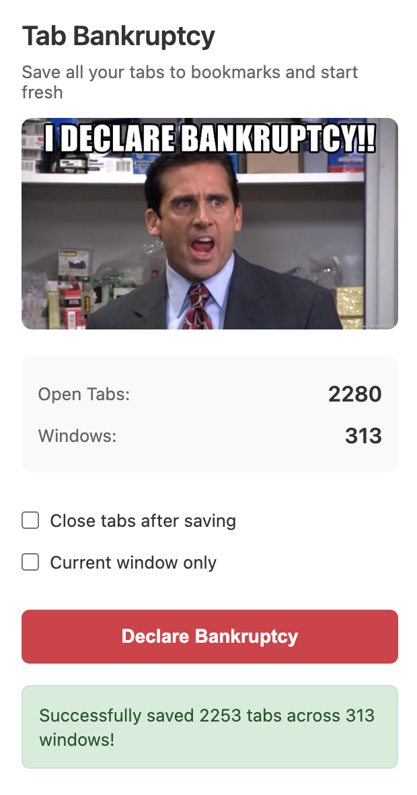

# Tab Bankruptcy Chrome Extension

Declare tab bankruptcy and save all your open tabs to bookmarks before starting fresh.

## Features

- **Save All Tabs**: Automatically bookmarks all open tabs across all windows
- **Organized Structure**: Creates timestamped folders with a subfolder per saved window
- **Flexible Options**:
  - Close tabs after saving (or keep them open)
  - Save only current window or all windows
- **Separate Every Domain**: Moves every HTTP(S) hostname into its own dedicated
  browser window—even when that hostname has only one tab. `github.com` tabs are
  split further into one window per owner/repository slug
- **Grouping Audit Report**: Opens a temporary before/after report containing
  every normal window, tab title, URL, and exact-duplicate provenance
- **Window Links**: Every report card can focus its corresponding live browser
  window directly—no Cmd+Tab hunting
- **Smart Filtering**: Skips invalid URLs (chrome://, edge://, etc.); windows left
  with no bookmarkable tabs are skipped entirely (no empty `Window N` folders)
- **Safe Cleanup**: Ensures at least one tab remains open to prevent closing the browser
- **Profile-aware**: Works on any Chrome profile — signed-in profiles with account
  (synced) bookmarks, local-only profiles, or both (saves to the synced bar when both exist)
- **Profile scope disclosure**: The popup shows which profile a run affects
  (`Running as: <your-account-email>`) and reminds you that other profiles are
  untouched — so a large single-profile run is never mistaken for a cross-profile one

## Multiple Chrome profiles

Chrome runs a separate, sandboxed instance of the extension in each profile, and an
extension can only ever see and act on **its own profile's** tabs, windows, and
bookmarks. Declaring bankruptcy in one profile never affects another.

To keep this clear, the popup displays `Running as: <email>` (the current profile's
Google account email; it reads `this Chrome profile (not signed in)` when the profile
has no signed-in account) plus a reminder that other profiles are not touched.

The extension **cannot** list your other profiles or show their tab/window counts —
that data lives outside the extension sandbox. To bankrupt another profile, open the
popup from a window of that profile and run it there.

## Demo



## Installation

### From Source

1. Clone or download this repository
2. Open Chrome and navigate to `chrome://extensions/`
3. Enable "Developer mode" (toggle in top right)
4. Click "Load unpacked"
5. Select the `tab-bankruptcy` directory

### Adding Icons (Optional)

The extension expects icons in the `icons/` directory:
- `icon16.png` - 16x16 pixels
- `icon48.png` - 48x48 pixels
- `icon128.png` - 128x128 pixels

Create a simple icon or use a placeholder until you have proper icons.

## Usage

1. Click the Tab Bankruptcy extension icon in your toolbar
2. Review the current tab/window count
3. Choose your options:
   - **Close tabs after saving**: Removes tabs after bookmarking (checked by default)
   - **Current window only**: Only save tabs from the current window
4. Click "Declare Bankruptcy"
5. Your tabs will be saved to a new bookmark folder

### Separate tabs into domain windows

1. Choose whether **Current window only** should limit the analyzed tabs
2. Optionally select **Split GitHub tabs by repository**. It is off by default
3. Click **Group Tabs by Domain**
4. Every exact HTTP(S) hostname is moved into its own dedicated window, including
   hostnames represented by only one tab. When GitHub repository splitting is
   selected, each owner/repository slug gets a separate window
5. Exact duplicate URLs are reduced to their first occurrence
6. A temporary report opens with complete before/after window state and the
   original windows for every kept and removed duplicate
7. Click **Focus window** on any report card to jump to that live window

Grouping accepts HTTP and HTTPS tabs and matches exact hostnames case-insensitively.
Paths, query strings, fragments, and HTTP versus HTTPS do not split a domain
group. When **Split GitHub tabs by repository** is selected, GitHub URLs with an
owner and repository path are grouped case-insensitively by their first two path segments, so
`github.com/octo-org/octo-repo/issues/1` and `github.com/Octo-Org/Octo-Repo/pull/2` share
one window. A different repository gets a different window. GitHub root and
single-segment pages stay in the general `github.com` window. Subdomains remain
separate, so `gist.github.com` is unaffected. A domain with one tab still gets
its own window. Internal pages, `file://` URLs, malformed URLs, and other schemes
stay where they are.

Duplicate identity is normalized exact URL equality. The first occurrence in
original window/tab order is kept; later exact copies are closed. Query-string
or fragment differences are not duplicates. Grouping creates no bookmarks.

Chrome may close an original window when grouping moves out its last tab. A
**Previous state** focus button reports that such a window is unavailable;
**Grouped state** buttons focus the newly-created destination windows.

## Bookmark Structure

Bookmarks are organized as follows:

```
Bookmarks Bar/
└── tab-bankruptcy-2025-10-05T10-30-00/
    ├── Window 1/
    │   ├── GitHub - example-org/example-repo
    │   ├── Google Search - Chrome Extensions
    │   └── ...
    ├── Window 2/
    │   ├── Documentation
    │   └── ...
    └── Window 3/
        └── ...
```

## Technical Details

- **Manifest Version**: V3 (latest Chrome extension standard)
- **Permissions**: `bookmarks`, `tabs`, `identity` (reads the current profile's
  account email to show which profile a run affects)
- **Architecture**:
  - Service worker (background.js) handles bookmark operations
  - Popup UI (popup.html/js) for user interaction
  - Message passing between popup and background script

## Development

### File Structure

```
tab-bankruptcy/
├── manifest.json          # Extension configuration
├── popup.html            # Extension popup UI
├── popup.js              # Popup interaction logic
├── background.js         # Service worker for bookmark operations
├── bookmarks-bar.js      # Pure Bookmarks Bar resolver (profile/account-aware)
├── bookmarks-bar.test.js # Unit tests for the resolver (`npm test`)
├── profile-disclosure.js # Pure formatter for the popup's "Running as:" line
├── profile-disclosure.test.js # Unit tests for the disclosure formatter
├── bankruptcy-plan.js    # Pure window planner (drops empty windows, renumbers)
├── bankruptcy-plan.test.js # Unit tests for the window planner
├── url-validation.js    # Shared bookmark URL eligibility predicate
├── url-validation.test.js # Tests all accepted/blocked schemes
├── domain-grouping.js    # Pure hostname/GitHub-repository grouping planner
├── domain-grouping.test.js # Unit tests for domain grouping
├── grouping-report.js   # Pure report model and summary counts
├── grouping-report.test.js # Unit tests for report data
├── grouping-operation.js # Injected/testable browser-operation orchestration
├── grouping-operation.test.js # Mutation order, scope, and failure tests
├── window-focus.js      # Validated report-to-window focus operation
├── window-focus.test.js # Valid, invalid, and closed-window focus tests
├── report.html/js/css   # Temporary before/after grouping report
├── manifest-contract.test.js # Permissions and packaged report surface
├── styles.css            # Popup styling
├── icons/                # Extension icons
│   ├── icon16.png
│   ├── icon48.png
│   └── icon128.png
└── README.md            # This file
```

### Key Functions

**background.js:248**
- `handleBankruptcy()` - Main logic for saving tabs and creating bookmark structure
- `isValidUrl()` - Filters out invalid URLs that can't be bookmarked

**popup.js:58**
- `updateStats()` - Displays current tab/window counts
- Message passing to background script via `chrome.runtime.sendMessage()`

### Testing

The Bookmarks Bar resolution logic is a pure function (`bookmarks-bar.js`) with no
browser dependencies, so it can be unit-tested with Node's built-in test runner:

```bash
npm test
```

Run all source and version checks with:

```bash
npm run validate
```

Every merged change must increment both `manifest.json` and `package.json` by
exactly one SemVer step: major for breaking changes, minor for features, patch
for fixes, documentation, maintenance, and tweaks. Pull-request CI compares the
new version with the base branch and rejects a missing or invalid increment.

Tests cover local-only profiles, account-bookmarks-only profiles, profiles with
both bars (synced-bar precedence), the no-bar error case, bankruptcy window and
URL planning, profile disclosure, every-domain separation, exact deduplication,
Chrome-operation sequencing/failures, report modeling, and safe DOM rendering.

## Error Handling

- Validates bookmark creation success
- Skips invalid URLs (chrome://, edge://, etc.)
- Ensures at least one tab remains open
- Provides user feedback for errors
- Continues processing even if individual tabs fail

## License

MIT

## Contributing

Contributions welcome! Please open an issue or submit a pull request.
